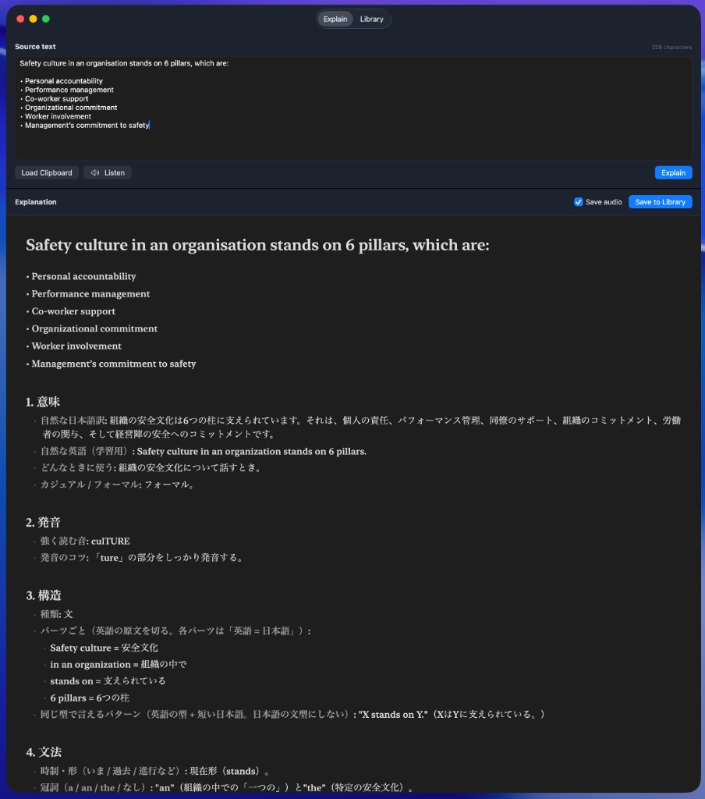

# LanguageTraining

LanguageTraining is a macOS and iPhone app for creating language-learning cards from copied text. It uses the OpenAI API to generate structured explanations and pronunciation audio, then stores the result in iCloud Drive so you can review the same library on Mac and iPhone.

The project was originally named EnglishCard and was renamed to LanguageTraining. Some legacy identifiers remain intentionally so existing local data and Keychain entries can be migrated.

## Features

- Create learning cards from pasted or clipboard text
- Tag cards with colored labels such as 仕事用 and 日常会話 (stored in the library data); add tags quickly from Explain, Library, or Settings
- Filter the Library by tag (all, one tag, or uncategorized); change a card’s tag from the row dropdown or the context menu
- Study mode: Japanese→English+pronunciation or English+pronunciation→Japanese, with spaced-repetition ordering and learning statistics
- Visual Study dashboard with accuracy / mastery rings, deck composition bar, and a 14-day activity chart
- Generate structured explanations with meaning, pronunciation, structure, grammar, vocabulary, examples, and notes
- Store explanations as structured JSON fields (translation, pronunciation, grammar, …), not only one markdown blob; section 1 is titled 日本語訳
- Write explanations for an adult English learner (about CEFR A2) who wants to work at a foreign company, not in a schoolbook tone
- Keep English chunks and patterns in the structure and vocabulary sections; gloss them in the explanation language
- Show the original text once, at the start of the explanation
- Estimate the API cost at the end of the explanation, in a currency that matches the explanation language
- Choose the explanation language
- Generate and save pronunciation audio with OpenAI text-to-speech
- Search and review saved cards. Library detail shows the explanation only, so the original text is not repeated
- On Mac, restore the last window position, window size, and split-pane sizes
- Import and export learning data as ZIP archives
- Store API keys in Keychain
- Share the card library between Mac and iPhone through an iCloud Drive folder

## Usage example

Paste English text in Explain, then generate a Japanese explanation. The original stays at the top of the explanation, followed by meaning, pronunciation, structure, and grammar.



This screenshot is from the verified setup: a Japanese speaker learning English, with Explanation Language set to Japanese.

## Requirements

- macOS 26.2 or later for the Mac app
- iOS 18 or later for the iPhone app
- Xcode
- An Apple ID signed in to iCloud Drive (for Mac and iPhone sharing)
- OpenAI API key

## Install as a Mac app

Build a Release `.app` and install it next to other applications (Launchpad, Spotlight, Dock):

```text
./scripts/install-app.sh
```

This installs `LanguageTraining.app` to `/Applications` when possible, otherwise to `~/Applications`. The install is intended for personal use on this Mac.

After changing the source, run the same script again to replace the installed app.

## Setup in Xcode

1. Clone the repository.
2. Open `LanguageTraining.xcodeproj` in Xcode.
3. Select the `LanguageTraining` scheme for Mac, or `LanguageTraining iOS` for iPhone.
4. Build and run. For the Mac app you can also run `./scripts/install-app.sh`.
5. Open Settings and enter your OpenAI API key. On iPhone, use the Settings tab. Enter the key on each device; it is stored in that device's Keychain.

The API key is not stored in the repository.

For first-run details, sharing, and iPhone Files setup, see `LanguageTraining/QUICKSTART.md`.

## Run on iPhone

1. Connect an iPhone, or choose an iOS 18 simulator.
2. Select the `LanguageTraining iOS` scheme and that device.
3. Confirm Signing & Capabilities uses your Apple ID team and Automatic signing.
4. Press `Command + R`.

On a physical iPhone, enable Developer Mode and trust the developer certificate under Settings → General → VPN & Device Management. A personal team certificate expires after about seven days; run the app from Xcode again to renew it.

## Data Storage

When iCloud Drive is available on Mac, cards and audio are stored in:

```text
iCloud Drive/LanguageTraining/
```

A personal Apple ID cannot use a paid iCloud app container, so sharing uses this ordinary iCloud Drive folder instead.

On iPhone, open Settings and tap Choose Folder. In Files, tap Browse, then iCloud Drive, then LanguageTraining, then Open. If iCloud Drive is missing from Locations, turn it on in iPhone Settings → Apple ID → iCloud → iCloud Drive, or tap … in Files → Edit and enable iCloud Drive.

If iCloud Drive is off, or iPhone has not chosen the folder, the app uses local storage. On Mac that is:

```text
~/Library/Application Support/LanguageTraining/
```

The app can also import legacy data from:

```text
~/Library/Application Support/EnglishCard/
```

Import backs up existing data here (this folder stays on the device):

```text
~/Library/Application Support/LanguageTraining_Backups/
```

The first launch after choosing an iCloud Drive folder may show “Loading library…” while files download. That wait runs in the background so the rest of the app stays responsive.

## Verified usage

Hands-on checks so far cover **Japanese speakers learning English**, with Explanation Language set to Japanese and English source text.

Other combinations have not been verified, including:

- Other explanation languages (English, Korean, Chinese, Vietnamese, French, Spanish, German)
- Source text that is not English
- Learners other than adult Japanese speakers of English

The UI and prompts still expose those options. Treat them as untested.

## Project Structure

```text
LanguageTraining/
├── LanguageTraining.xcodeproj
├── LanguageTraining/
│   ├── EnglishCardApp.swift
│   ├── ContentView.swift
│   ├── ExplainView.swift
│   ├── LibraryView.swift
│   ├── SettingsView.swift
│   ├── FormattedMarkdownView.swift
│   ├── APICost.swift
│   ├── LayoutPersistence.swift
│   ├── Card.swift
│   ├── LibraryTag.swift
│   ├── StudyProgress.swift
│   ├── CardStudyContent.swift
│   ├── StudyView.swift
│   ├── StudyStatsDashboard.swift
│   ├── CardStore.swift
│   ├── CardXMLCodec.swift
│   ├── LibraryJSONCodec.swift
│   ├── OpenAIClient.swift
│   ├── AppSettings.swift
│   ├── AppStorage.swift
│   ├── AudioPlayerService.swift
│   ├── DocumentFolderPicker.swift
│   ├── CoordinatedFile.swift
│   ├── LibraryArchive.swift
│   ├── PlatformSupport.swift
│   ├── ZipArchive.swift
│   ├── Keychain.swift
│   └── Assets.xcassets
├── LanguageTrainingiOS/
│   ├── Info.plist
│   └── LanguageTrainingiOS.entitlements
├── docs/
│   └── explain-example.jpg
├── DataManager.swift
├── scripts/
│   ├── install-app.sh
│   └── generate-app-icon.swift
└── README.md
```

## License

This project is licensed under the [MIT License](LICENSE).

## Notes

- Do not commit API keys or local user data.
- Signing uses an Apple Development certificate, which is enough for personal use on this Mac and on an iPhone registered to the same team.
- If Mac and iPhone edit the library at the same time, the last saved `cards.json` wins. After saving on one device, wait until iCloud Drive finishes syncing before editing on the other.
- To check that the app does not send your API key anywhere except the OpenAI Base URL you configured, see [Verify that the app does not misuse the API key](LanguageTraining/README.md#verify-that-the-app-does-not-misuse-the-api-key).
